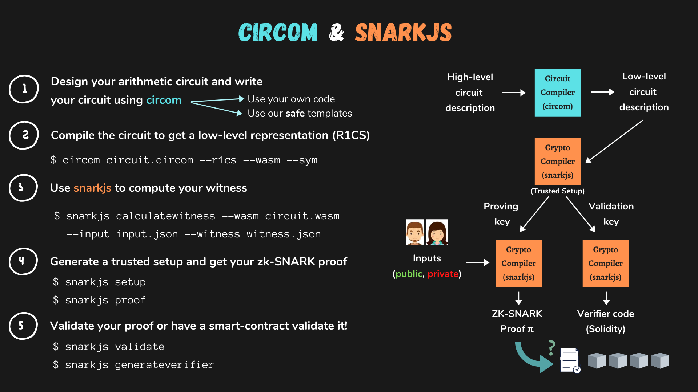

# What is Circom 2
The circom compiler and its ecosystem of tools allows you to create, test and create zero knowledge proofs for your circuits.  

- *Circom* is a compiler written in Rust for compiling circuits written in the circom language. The compiler outputs the representation of the circuit as constraints and everything needed to compute different ZK proofs.

- *Circomlib* is a library of circom templates that contains hundreds of circuits such as comparators, hash functions, digital signatures, binary and decimal convertors and many more. You can also create your custom templates, but before start coding, we recommend you to take a look at our already created templates.

- *circomlibjs* is a Javascript library that provides programs to compute the witness of several circuits of circomlib

- *snarkjs* is a npm package that contains code to generate and validate ZK proofs from the artifacts produced by circom

## Visual summary


# Installation dev environnement
- The core tool is the circom compiler which is written in Rust. To have Rust available in your system, you must install rustup. 

- We also distribute a series of npm packages so Node.js and some package manager like npm or yarn should be available in your system. Recent versions of Node.js include big integer support and web assembly compilers that help run code faster, so to get a better performance, install version 10 or higher
Open a terminal and enter the following command :

```
docker build -t circom-crm3 . 
```

This dockerfile launch a dev environnement with :   
- Installing dependencies like rustup 
  ```
  FROM rust:latest
  ```
- Installing circom 
  ```
  RUN git clone --depth=1 https://github.com/iden3/circom.git 
  WORKDIR /circom
  RUN RUSTFLAGS="-g" cargo build --release
  RUN cargo install --path circom
  RUN strip -g /usr/local/cargo/bin/circom \
  && echo "CARGO_VERSION='$(cargo --version)'" >> /etc/image-info \
  && echo "RUST_VERSION='$(rustc --version)'" >> /etc/image-info
  ```

- Launch container with command 
  ```
  docker run --rm -it -v $(pwd):/app -w /app circom-cr3 bash
  ```

- Install node version > 10 including web assembly compilers
  ```
  nvm install 20
  ```

- Installing snarkjs
  ```
  npm install -g snarkjs
  ```

# Writing crm3.0 circuit
## Code Walkthrough
```
pragma circom 2.0.0; 

include "../node_modules/circomlib/circuits/comparators.circom";

// Eligible for Offer 1.
// workType = 0,1 (Business Owner, Salaried Employees) 
// Age 18 or more
// Income 5000 or more

 // All Others eligible Offer 2

template IsEligible() {
     // private
    signal input workType;
    signal input age; 
    signal input income;

    // public signals - declared public on last line of this file
    signal input workTypeEligible;
    signal input ageEligible;
    signal input incomeEligible;

    // true/false
    signal output out;

    // **** Constraint 1 ****
    //If workType same as workTypeEligible
    workType === workTypeEligible;

    // max age 127
    component ageGreaterThan = GreaterThan(8); 
    ageGreaterThan.in[0] <== age;
    ageGreaterThan.in[1] <== ageEligible;
    
    // **** Constraint 2 ****
    // if age is greater than ageEligible, out value is 1 
    ageGreaterThan.out === 1;

    component incomeGreaterThan = GreaterThan(32); 
    incomeGreaterThan.in[0] <== income;
    incomeGreaterThan.in[1] <== incomeEligible;
    
    // **** Constraint 3 ****
    // if income is greater than incomeEligible, out value is 1 
    incomeGreaterThan.out === 1;

    signal intermediate;
    intermediate <== ageGreaterThan.out * incomeGreaterThan.out; 
    out <==  intermediate * workType;

    // **** Constraint 4 ****
    // All 3 conditions satisfied - salaried, age 18+ & meets income expectations
    out === 1;
}
component main {public [workTypeEligible, ageEligible, incomeEligible]} = IsEligible();
``` 
## Overview 
The given Circom 2.0.0 circuit checks if an individual is eligible for a specific offer based on their work type, age, and income. There are two offers:

Offer 1: Eligible for business owners or salaried employees who are 18 years or older and have an income of 5000 or more.
Offer 2: Eligible for everyone else.

## Circuit Components
### Inputs
*workType*: Indicates the type of work (0 or 1 for Business Owner or Salaried Employees).  
*age*: The age of the individual.  
*income*: The income of the individual.  

### Public Inputs
*workTypeEligible*: Expected work type for eligibility  
*ageEligible*: Minimum age requirement (18)  
*incomeEligible*: Minimum income requirement (5000)  

### Internal Components and Logic
- *Work Type Check* The circuit checks if the workType matches workTypeEligible
- *Age Check* A GreaterThan comparator component (ageGreaterThan) is used to check if the age is greater than or equal to ageEligible
- *Income Check* Another GreaterThan comparator component (incomeGreaterThan) is used to check if the income is greater than or equal to incomeEligible
- *Final Elibility* 
  - An intermediate signal is calculated by multiplying the results of the age and income checks.
  - The final output out is calculated by multiplying the intermediate signal with the workType check result

### Constraints
- The workType must match the workTypeEligible
- The age must be greater than or equal to ageEligible (minimum 18)
- The income must be greater than or equal to incomeEligible (minimum 5000)
- All three conditions must be satisfied for out to be 1, indicating eligibility for Offer 1


# Compiling circuits 
Now is time to compile the circuit to get a system of arithmetic equations representing it. As a result of the compilation we will also obtain programs to compute the witness. We can compile the circuit with the following command (from executeGroth16.sh file):
```
circom zeroPartyData_1.circom --r1cs --wasm --sym --c
```
With these options we generate three types of files: 
- --r1cs: it generates the file zeroPartyData_1.r1cs that contains the R1CS constraint system of the circuit in binary format.
- --wasm: it generates the directory zeroPartyData_1_js that contains the Wasm code (zeroPartyData_1.wasm) and other files needed to generate the witness.
- --sym : it generates the file zeroPartyData_1.sym , a symbols file required for debugging or for printing the constraint system in an annotated mode.
- --c : it generates the directory zeroPartyData_1_cpp that contains several files (zeroPartyData_1.cpp, zeroPartyData_1.dat, and other common files for every compiled program like main.cpp, MakeFile, etc) needed to compile the C code to generate the witness.

# Computing the witness with WebAssembly
we need to calculate all the signals of the circuit that match all the constraints of the circuit. For that, we will use the Wasm module generated bycircom that helps to do this job.  
Let us start with the Wasm code. Using the generated Wasm binary and three JavaScript files, we simply need to provide a file with the inputs and the module will execute the circuit and calculate all the intermediate signals and the output. The set of inputs, intermediate signals and output is called witness:  

We generate a .zkey file that will contain the proving and verification keys together with all phase 2 contributions. Execute the following command to start a new zkey:
```
snarkjs groth16 setup zeroPartyData_1.r1cs ptau/powersOfTau28_hez_final_${CONFIG_PTAU_VERSION}.ptau zeroPartyData_1_0000.zkey  

snarkjs zkey contribute zeroPartyData_1_0000.zkey zeroPartyData_1_final.zkey --name="zeroPartyData" -v -e="some random text"
```

# Generate smart verifier smart contract
We generate the Solidity code using the command(from generateSolidityVerifierContract.sh) :  
```
snarkjs zkey export solidityverifier zeroPartyData_1_final.zkey zeroPartyData_1_Verifier.sol
```
This command takes validation key zeroPartyData_1_0001.zkey and outputs Solidity code in a file named verifier.sol.